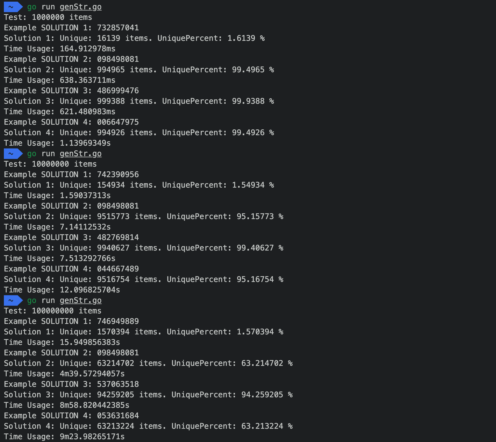
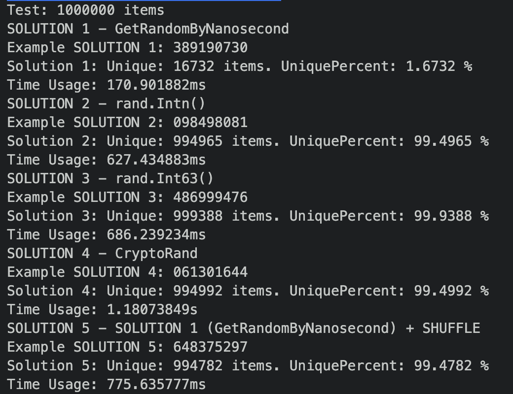
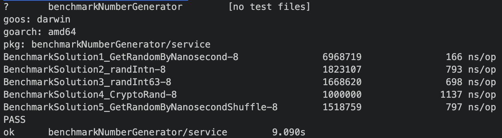

# BenchmarkNumberGenerator

A project for generate unique number comparison report

## 📦 Built With

- [X] GO 1.14.2

## 🏷 Versions

v0.1.0

- Generate Unique Number Comparison Report for 5 solutions
  - Solution 1: GetRandomByNanosecond
  - Solution 2: randIntn
  - Solution 3: randInt63
  - Solution 4: CryptoRand
  - Solution 5: GetRandomByNanosecondShuffle
- Benchmark for 5 solutions

## ⚙ How to use

1. Clone project

    ```bash
    git clone https://github.com/buildingwatsize/benchmarkNumberGenerator.git
    ```

2. Run Benchmark Test by command

    ```bash
    go test ./... -bench=.
    ```

3. Run project by command

    ```bash
    go run main.go
    ```

## 📋 Options

- `main.go` in `numberOfLoopTest` you can specific a Int number for loop test

## 🏞 Example Images

### Comparison for 1M, 10M, and 100M



### Example Result `go run main.go`



### Example Result `go test ./... -bench=.`

